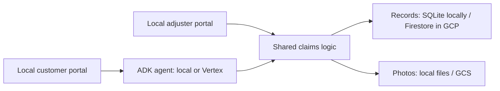

# Insurance claims agent

An auto insurance intake workflow built with Google ADK, with local customer
and adjuster portals. The agent can run locally or on Vertex AI Agent Engine.
Both portals run on your computer.

## Architecture



The root is a **uv workspace**, not an application package. Members share a
lockfile and development environment, while the agent has its own deployment
dependencies.

| Path | Purpose |
| --- | --- |
| [`agent/`](agent/README.md) | ADK workflow and Vertex deployment entry point |
| [`local_apps/`](local_apps/README.md) | Customer chat and adjuster queue |
| [`packages/claims_core/`](packages/claims_core/README.md) | Shared claims rules, records, and evidence storage |
| [`data/seed/`](data/README.md) | Example records; runtime writes go elsewhere |
| [`docs/`](docs/architecture.md) | Architecture, data, deployment, and claims policy |

## Local setup

Use Python 3.12 and [uv](https://docs.astral.sh/uv/). Run commands from the
repository root.

```bash
uv sync --all-packages
cp .env.example .env
```

Set `GOOGLE_API_KEY` in `.env` for Gemini, leaving
`GOOGLE_GENAI_USE_VERTEXAI=FALSE`, `AGENT_BACKEND=local`, and
`CLAIMS_STORE=local`. Local agent execution still calls the Gemini service;
it requires model credentials and an internet connection.

Initialize the local records from the checked-in examples:

```bash
uv run --package claims-core claims-data seed --source data/seed --apply --with-evidence
```

The local database lives at `.local/data/claims.sqlite3`; bundled example
photos are copied to its evidence directory. Seed data is never updated by
the application. See [data storage](docs/data.md) for backend configuration
and imports.

## Run

For ADK's development UI:

```bash
uv run --package insurance-claim-agent adk web agent
```

Open <http://localhost:8000> and select `insurance_claim_agent`.

For the two portals, use separate terminals:

```bash
uv run --package claims-local-apps --extra local-agent python -m uvicorn client_portal.app:app --port 8002 --reload
```

```bash
uv run --package claims-local-apps python -m uvicorn adjuster_portal.app:app --port 8001 --reload
```

Open <http://localhost:8002> for customer chat and <http://localhost:8001>
for the adjuster queue. Local chat sessions are held in memory; claim records
persist in the database. The portals have no login and are intended for localhost.

## Use the deployed agent

Follow the [Vertex deployment guide](docs/deployment.md), then set
`AGENT_BACKEND=vertex` and `AGENT_ENGINE_ID` in the local `.env`. Configure
the local portals and deployed agent to use the same Firestore database and
GCS evidence bucket. The portals continue running locally.

## Verify

```bash
uv run --all-packages pytest
uv run --all-packages ruff check .
uv run --all-packages ruff format --check .
```

## Workflow and rules

The workflow runs intake → assessment → escalation → customer reply. It
preserves this project's existing demo rules: low-priority claims may be
auto-approved, hard fraud signals may trigger auto-denial, and other claims
go to a human adjuster. A coverage denial recommendation still requires
human review.

See [architecture](docs/architecture.md), the [claims handling policy](docs/claims_handling_policy.md),
and the [ten-step process](docs/insurance_steps.md). These are demonstration
rules, not a validated insurance decision system.

The original [notebook](02_Insurance_Claims_Agent.ipynb) and `docs/reference/`
are historical snapshots; use the guides above for the current application.
