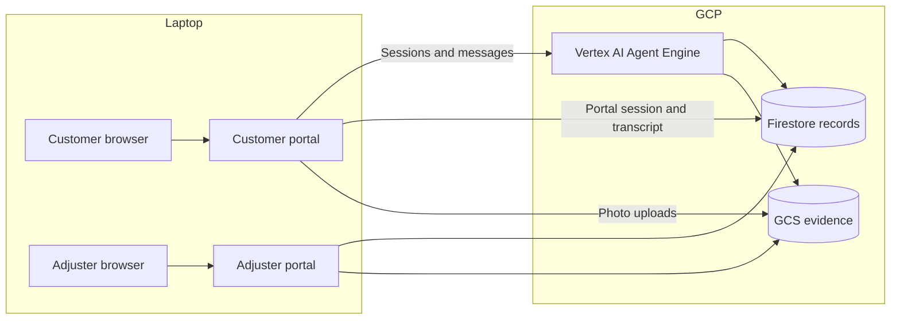
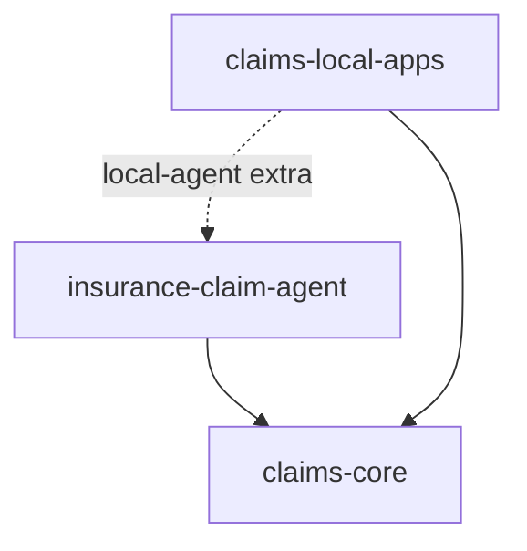

# Architecture

Only the agent is intended for cloud deployment. The customer and adjuster
portals run locally, sharing claims rules through `claims-core`.

## Runtime

For local development, `AGENT_BACKEND=local` runs the workflow inside the
customer portal, while `CLAIMS_STORE=local` uses SQLite and local evidence
files. The Gemini model call still uses a remote API. ADK's web UI can run
the agent separately for debugging.

The browser talks to its local FastAPI server. Server-side Application
Default Credentials authorize cloud access; Agent Engine uses its runtime
service account. The agent and adjuster must point to the same records
store, and all photo readers must be able to access the evidence location.

## Package boundaries

The root uv workspace coordinates one lockfile and local environment.
Each member declares its own dependencies. Deployment exports only the
agent's dependencies and bundles the agent and shared core; local portal
code and browser assets stay on the laptop.

## Claim flow

1. **Intake:** collect the incident, identify the policy, and attach evidence.
2. **Assessment:** check coverage, risk signals, and repair estimates. Confirmed
   lack of coverage skips risk and cost assessment.
3. **Escalation:** determine priority, recommend a decision, and persist either
   an automatic outcome or a pending adjuster handoff.
4. **Reply:** explain the executed outcome or tell the customer the claim is
   awaiting review.
5. **Human review:** the adjuster portal records the final decision for pending claims.

The ADK workflow controls ordering and waits across intake turns. Tools
adapt ADK session state to shared domain functions. Deterministic rules
live in `claims-core`; image interpretation and exclusion assessment also
use model judgment, as specified in the [claims policy](claims_handling_policy.md).

## State

Chat sessions and claims records have different lifetimes. Local ADK
sessions are in memory; Vertex sessions belong to the deployed agent.
The customer portal stores its session metadata and transcript in
`client_sessions`, allowing Vertex conversations to resume after a portal
restart. Durable records live in SQLite or Firestore; photo bytes live
in local files or GCS. Outcome records are application data, not an
independently immutable audit service.

The refactor retains the existing record shapes and demo decision rules.
It does not migrate a remote datastore or deploy resources on startup.
See [data](data.md) and [deployment](deployment.md) for those explicit steps.
